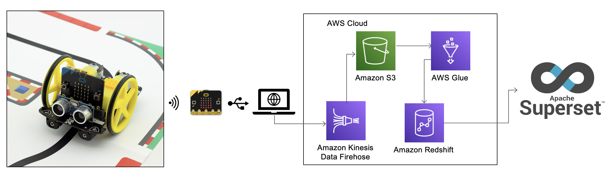

# Micro:Bit Streaming Data



## Objective
I will learn how to assemble and how to capture and stream all real-time data into AWS. 
Also, I want to use this data to create a visual data exploration.

## Description
Using the BBC micro:bit too built an autonomous car and another micro:bit to be a receiver to capture all raw data 
generated from the gyroscope, proximity sensor, line follow sensor, power consumption and velocity. 
These raw data will be streamed into AWS to explore and visualize.

## Installation

### Requirements:

1) Setup your IAM User credentials
- ```~/.aws/config```
```
   [profile my_aws_profile]
   region = us-east-1
   output = yaml
```
  - ```~/.aws/credentials```
```
   [profile my_aws_profile]
   aws_access_key_id = <my_access_key_id> 
   aws_secret_access_key = <my_secret_access_key>
 ```
2) Manually create a virtualenv on MacOS and Linux
```shell script
$ python3 -m venv .venv
```
3) After the init process completes and the virtualenv is created, you can use the following
step to activate your virtualenv.
```shell script
$ source .venv/bin/activate
```
4) Once the virtualenv is activated, you can install the required dependencies.
```shell script
$ pip install -r requirements.txt
```

### Environment Secrets:
1) Make sure the env vars are present in GitHub settings look at deploy.yaml where they are used:
 - **AWS_ACCESS_KEY_ID**
 - **AWS_SECRET_ACCESS_KEY**
 - **AWS_DEFAULT_REGION**
2) Make deploy
