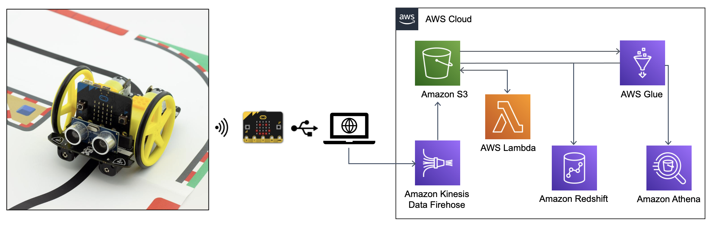

# Micro:Bit Streaming Data



## Objective
I will learn how to assemble and how to capture and stream all real-time data into AWS. 
Also, I want to use this data to create a visual data exploration.

## Description
Using the BBC micro:bit too built an autonomous car and another micro:bit to be a receiver to capture all raw data 
generated from the gyroscope, proximity sensor, line follow sensor, power consumption, velocity and more. 
These raw data will be streamed into AWS to explore and visualize. The result screenshots will be at the end.

## Microbit
The BBC micro:bit is a pocket-sized computer that introduces you to how software and hardware work together. 
It has an LED light display, buttons, sensors and many input/output features that you can program and physically interact with.


## Car
The car is equipped with two bi-directional DC motors with variable speed control, light, buzzer, obstacle detection and
avoidance, line follow sensor, pen hole to draw, battery holders for 4x AA batteries and an onboard edge connector for 
the micro:bit.


## Data

These are all the data collected and transmitted to be ingested into AWS S3 a in a 
JSON format.
* Device Serial Number
* Time
* Acceleration (mg) X
* Acceleration (mg) Y
* Acceleration (mg) Z
* Tembo
* Temperature (C)
* Distance Sensor
* Light Level
* Sound Level
* Compass Heading (°)
* Magnetic Force (µT) X
* Magnetic Force (µT) Y
* Magnetic Force (µT) Z
* Magnetic Force (µT) Strength
* Line Sensor (Left)
* Line Sensor (Right)
* Millivolts
* Total time in seconds


### JSON Example

```
{'event_timestamp': 1637930336.545796, 'time': 1968, 'signal': -49, 'key': 'carSN', 'value': -1216136376}
{'event_timestamp': 1637930340.877306, 'time': 4061, 'signal': -50, 'key': 'a.x', 'value': -116}
{'event_timestamp': 1637930344.877306, 'time':9061, 'serial':-1216136376, 'sigal':-52, 'key':'a.y', 'value':1044}
{'event_timestamp': 1637930347.969918, 'time': 14057, 'signal': -54, 'key': 'a.z', 'value': 84}
{'event_timestamp': 1637930352.963717, 'time': 19057, 'serial': -126136376, 'signal': -55, 'key': 'tembo', 'value': 120}
{'event_timestamp': 1637930357.963863, 'time': 24045, 'signal': -55, 'key': 'temp', 'value': 23}
{'event_timestamp': 1637930362.950302, 'time': 29013, 'signal': -54, 'key': 'dist', 'value': 11}
{'event_timestamp': 1637930367.923427, 'time': 33977, 'signal': -54, 'key': 'light', 'value': 51}
{'event_timestamp': 1637930372.883084, 'time': 38969, 'signal': -54, 'key': 'sound', 'value': 0}
{'event_timestamp': 1637930377.877778, 'time': 43929, 'serial': -121613376, 'signal': -53, 'key': 'compass', 'value': 93}
{'event_timestamp': 1637930382.835778, 'time': 48897, 'signal': -54, 'key': 'mag.x', 'value': -126.892}
{'event_timestamp': 1637930387.804328, 'time': 53845, 'signal': -54, 'key': 'mag.y', 'value': -280.234}
{'event_timestamp': 1637930392.751032, 'time': 58797, 'signal': -47, 'key': 'mag.z', 'value': -95.765}
{'event_timestamp': 1637930397.70565, 'time': 63741, 'signal': -46, 'key': 'mag.str', 'value': 322.185}
{'event_timestamp': 1637930402.650304, 'time': 68709, 'signal': -46, 'key': 'left', 'value': 243}
{'event_timestamp': 1637930407.650304, 'time':73665, 'serial':-1216136376, 'signal':-51, 'key':'right', 'value'165}'
{'event_timestamp': 1637930412.575524, 'time': 78613, 'signal': -51, 'key': 'm.volts', 'value': 102.941176470588}
{'event_timestamp': 1637930417.524824, 'time': 81537, 'signal': -51, 'key': 'seconds', 'value': 21.537}
```

## Installation

### Requirements:

1) Setup your IAM User credentials
- ```~/.aws/config```
```
   [profile my_aws_profile]
   region = us-east-1
   output = yaml
```
  - ```~/.aws/credentials```
```
   [profile my_aws_profile]
   aws_access_key_id = <my_access_key_id> 
   aws_secret_access_key = <my_secret_access_key>
 ```
2) Manually create a virtualenv on MacOS and Linux
```shell script
$ python3 -m venv .venv
```
3) After the init process completes and the virtualenv is created, you can use the following
step to activate your virtualenv.
```shell script
$ source .venv/bin/activate
```
4) Once the virtualenv is activated, you can install the required dependencies.
```shell script
$ pip install -r requirements.txt
```
5) Microbit Files
Inside the folder microbit_files contains the code for the autonomous car and the receiver.
Please go to the https://makecode.microbit.org/ follow the instruction to connect the microbit.
Then copy and past the code to download to each microbit.


### Environment Secrets:
1) Make sure the env vars are present in GitHub settings look at deploy.yaml where they are used:
 - **AWS_ACCESS_KEY_ID**
 - **AWS_SECRET_ACCESS_KEY**
 - **AWS_DEFAULT_REGION**
2) Make deploy


## CI/CD
This repo uses GitHub Actions for CI/CD. 


## Results

